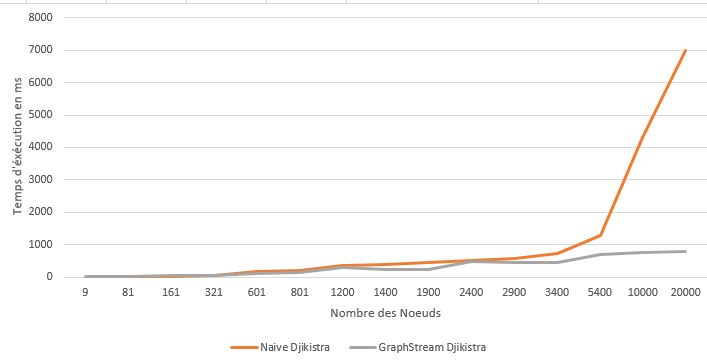

# Graph Project

# Introduction 

Ce travail consiste à réaliser une implémentation de l’algorithme Djikistra comme vu en cours des graphes, et de tester cet algorithme sur plusieurs graphes de différentes tailles à l’aide d’un générateur des graphes aléatoires, ensuite refaire des tests sur ces graphes avec l’algorithme du GraphStream puis comparer la performance de ces deux algorithmes.

# Générateur des Graphes

Pour tester nos algorithmes, nous avons besoin de plusieurs graphes de tailles différentes, pour cela j’ai utilisé le « Random Graph Generator » du GraphStream pour une génération des graphes aléatoirement.
J’ai créé une nouvelle classe nommée RandomGen, dans lequelle j’ai fait un constructeur qui initialise les variables de la classe : Nom du graphe, nombre des nœuds et le degré moyen des nœuds

```
public class RandomGen {
    private String GraphName;
    private int n,d;

    public RandomGen(String GraphName, int n, int d){
        this.GraphName = GraphName;
        this.n = n;
        this.d = d;
    }
```

Puis j’ai créé la fonction generate() qui fait la génération d'un graphe aléatoirement avec les variables données en constructeur, puis j’ai attribué des poids aléatoirement aux arréts avec la bibliothèque random du Java

```
public Graph generate(){
    System.setProperty("org.graphstream.ui", "swing");
        
    Graph graph = new SingleGraph(GraphName);
    Generator generator = new RandomGenerator(this.d);
    Random r = new Random();

    generator.addSink(graph);
    generator.begin();
    for(int i =0; i<n; i++){
        generator.nextEvents();
    }
    generator.end();

    graph.edges().forEach(e -> {
            e.setAttribute("poids" , r.nextInt(12) );
            e.setAttribute("ui.label" , e.getAttribute("poids"));
        });
        
        for(int i = 0; i< graph.getNodeCount(); i++) {
        	graph.getNode(i).setAttribute("ui.label", "node" + i);
        }
        return graph;
    }
}
```

# Version Naive de l’algorithme de Djikistra 

Dans cette partie, j’ai essayé d’implémenter une version naive de l’algorithme de Djikistra à l’aide du cours.
Djikistra est un algorithme de plus court chemin entre un sommet et tous les autres sommets, on peut généralement l’utiliser dans tous les cas sauf au cas où les poids sont négatifs.
Pour implémenter une version naive de l’algorithme de Djikistra, j’ai utilisé les HashMaps, j’ai créé deux HashMaps : une pour l’enssemble des sommets non traités et une autre pour les sommets traités, ces HashMap contiennent les nœuds et distances associées, puis j’ai initialisé toutes les distances à l’infini (Ineteger.MAX_VALUE du Java), sauf le sommet source fourni en paramètre du constructeur est initialisé avec 0.
```
  public MyDjikistra(Graph graph, String source){
        this.graph = graph;
        this.source = source;

        //Liste des noueds non parcourus
        HashMap<Node,Integer> nonVisited = new HashMap<>();

        //Liste des noeuds dèjà parcourus
        HashMap<Node,Integer> visited = new HashMap<>();

        //Initialiser la distance par l'infini pour tous les noeuds
        graph.nodes().forEach(e -> {
            nonVisited.put(e, Integer.MAX_VALUE);
        });

        //Initialiser le noued source par 0
        nonVisited.replace(graph.getNode(source), 0);
```

        
Ensuite, j’ai cherché le sommet avec la plus petite distance du source à l’aide d’une fonction que j’ai écrit : getMinNode () qui parcourt l’enssemble des sommets non traités et extrait le sommet avec la plus petite distance en comparant les valeurs de chaque élement du HashMap, puis renvoie le Node avec cette distance.

```
   public Node getMinNode(HashMap<Node,Integer> nodes){
        Entry<Node, Integer> x = null;

        //Chercher la plus petite valeur dans la HashMap
        for (Entry<Node, Integer> node : nodes.entrySet()) {
            if (x == null || x.getValue() > node.getValue()) {
                x = (Entry<Node, Integer>) node;
            }
        }

        //Renvoyer le Noeud avec la valeur minimale
        return  x.getKey();
}
```

Puis, je fait une comparaison du distance des voisins des sommets afin de choisir le plus proche sommet du parent, après j’ajoute ce sommet dans l’ensemble des sommets traités (au même temps je le retire de l’ensemble des sommets non traités) et je met à jour la distance du voisin. 
On refait cette itération pour tous les sommets dans l’ensemble des sommets non traités, jusqu’au moment où il n’y a aucun sommet dans la HashMap des sommets non traités.
```
      //parcourir tous les noeuds dans la liste des noueds non visités
        while(!nonVisited.isEmpty()){

        	//Extraire le noeuds avec la distance minimale
        	thisNode = getMinNode(nonVisited);
            if( thisNode == null){

                //nonVisited.forEach((n,i) -> visited.put(n,i));
                visited.put(thisNode,nonVisited.get(thisNode));
                nonVisited.remove(thisNode);
            }else{
                    //Parcourir tous les noeuds voisins du Nouveau noeud
            		thisNode.neighborNodes().forEach( v -> {
            			poids = (int) thisNode.getEdgeBetween(v).getAttribute("poids");
            				if(nonVisited.containsKey(thisNode) && nonVisited.containsKey(v)){
	                    		if(nonVisited.get(v) > nonVisited.get(thisNode) + poids ){
	                    				nonVisited.replace(v,nonVisited.get(thisNode) + poids);
	                    		}
            				}
            		});
               //Deplacé le noeud traité de liste des noeuds non-visités vers la liste des noeuds visités
                visited.put(thisNode,nonVisited.get(thisNode));
                nonVisited.remove(thisNode);
            }
            
        }
```

Pour vérifier le résultat de mon algorithme j’ai fait un affichage des distances de chaque sommet du nœud source.


# Version De Djikistra de GraphStream 

L’implémentation de l’algorithme de Djikistra de GraphStream utilise en interne Fibonacci Heap, une structure de données qui accélère son exécution pour les grands graphiques, l’algorihtme est simple à utiliser puisque l’implémentation est dèjà faite, donc il suffit de l’utiliser correctement 
- Il faut faire appel à la bibliothèque du Djikistra du GraphStream
- L’initialiser avec le graphe qu’on veut traité avec graph.init()
- Définir le sommet source du graphe avec graph.setSource()
- Faire appel à la fonction compute()

# Campagne de Tests 

Après l’implémentation des deux algorithmes, on passe vers la phase des tests, pour cela, j’ai utilisé le générateur du graphe aléatoire que j’ai créé, afin de générer plusieurs graphes de différentes tailles.
L’élément principal que j’ai fait varier est la taille du graphe (Nombre des nœuds du graphe), j’ai commencé par générer des graphes avec un nombres des nœuds inférieurs, puis j’ai passé à générer des graphes de grande taille avec un nombre des nœuds très élevés.
J’ai exécuté les deux algorithme à chaque fois, en mesurant le temps d’exécution de chacun des algorithmes.
Pour la mesure du temps d’exécution, j’ai sauvegardé le temps avant et après le déroulement des deux algorithmes.

# Résultats Obtenus 
Pendant les tests que j’ai effectué, j’ai noté le temps d’exécution de chaque algorithme avec le nombre des nœuds du graphe étudié pour les deux algorithmes, et j’ai obtenu les résultats suivants





Depuis ce graphe, on peut voir que pour les petits à moyens graphes ( avec un nombre de nœuds inférieur), le temps d’exécution moyen pour les deux algorithmes est très similaire.
Cependant, quand on augemente la taille du graphe étudié, le temps d’exécution de l’algorihtme dont j’ai implémenté augemente d’une façon significative.
En revanche, la version de l’algorithme de Djikistra de GraphStream, son temps d’exécution reste stable et ne varie que d’une façon très légère. 
Cette rapidité d’exécution de l’algorithme de GraphStream pour les grands graphes est dûe à l’implémentation qui utilise en interne Fibonacci Heap qui accélère l’exécution.


